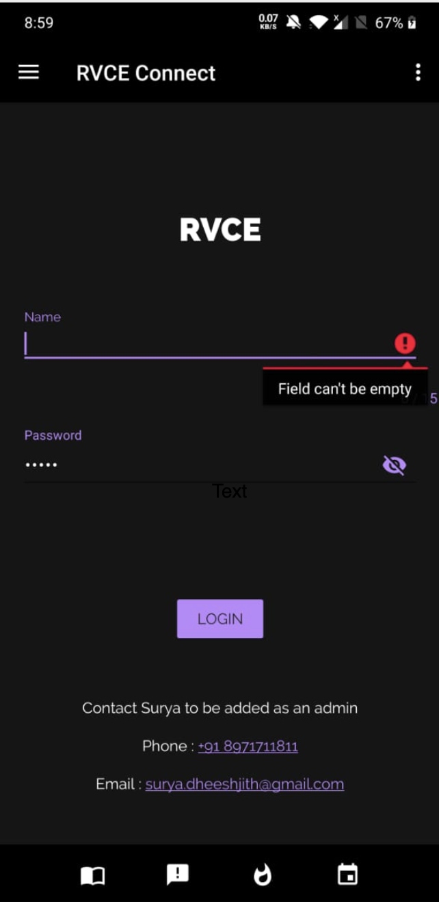
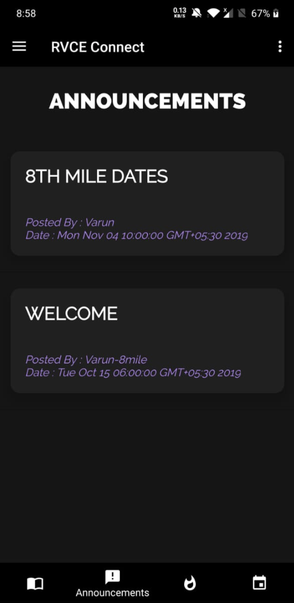
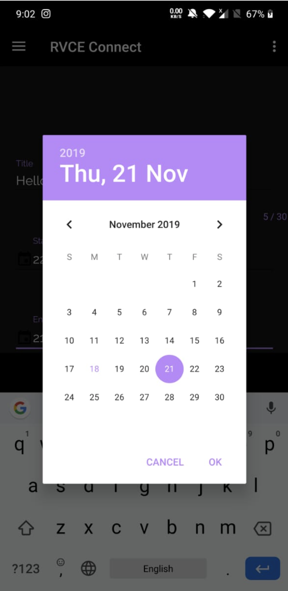
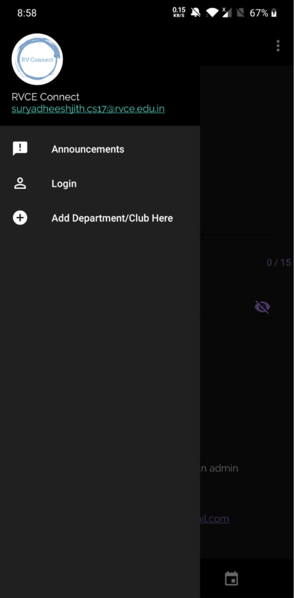

# University_Announcements_Android_App

This android application will be useful for college students and faculty of a university. At present the academic notifications released by most universities are displayed on the notice board of the college or department, or viewed through university website, or sent via Whatsapp messages or email. The students need to check the web page or notice board for each and every activities of the university. It is very difficult for a student to refer to university website on a daily basis. It is also inconvenient and inefficient to have announcements/notices from colleges scattered on various platforms. To resolve this issue, an android application is developed and this application is mainly for college students to get the information about daily tests, university examinations and any kind of academic related information. In this project the students, faculty & staff are registered by the admin. The staff of the particular department will upload the exam timetable, links for materials in this app by their own login id. The faculty, and even possibly the heads of the various clubs can create events using a specific login id. Using this app the student will automatically get the announcements made by the administration, departments or clubs. This will benefit both students as well as the college.

### Product Functions

* User can view various types of announcements and events.
* App has multiple tabs for different types of announcements, which provides ease of navigation.
* User can log in as admin.
* Admin can post or delete announcements and events.
* User can add favourite clubs and department to navigation drawer.

### Screenshots

**1. Login**

**2. Home**

**3. Adding an Event**

**4. Navigation Drawer**

### Authors
1. Surya Dheeshjith
2. Varun Komperla

***For more information, please look at the SRS in the pdf folder***
